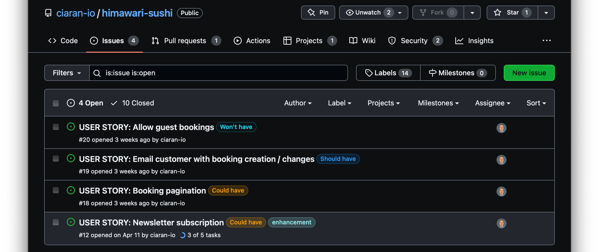
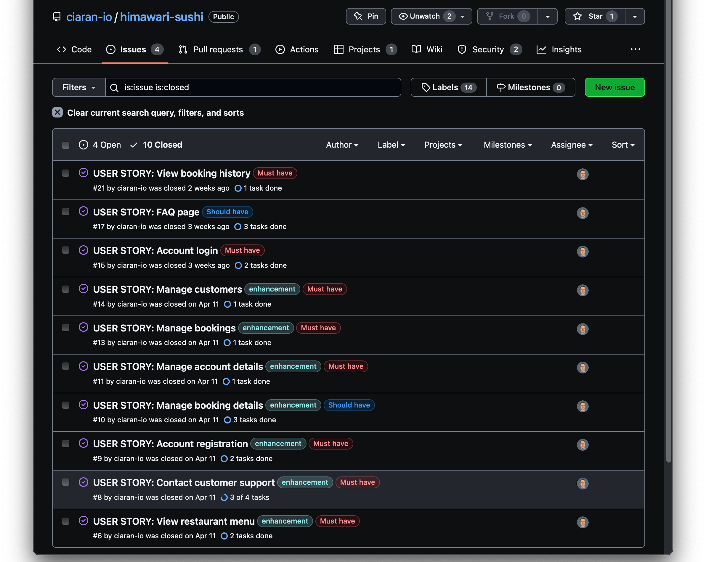

# Himawari sushi 

Looking for delicious and authentic Japanese food? Look no further than Himawari Sushi! Our restaurant is open Monday
through Saturday from 13:00pm - 10:00pm, and with our convenient app, you can easily make reservations for your next
visit.
Come experience the taste of authentic Japanese cuisine at Himawari Sushi.

Himawari Sushi, is where authentic Japanese cuisine meets modern convenience. You can view our most popular dishes &
sign up for our newsletter for a discount on your next meal. Join us for a culinary journey through Japan and experience
the best of what Himawari Sushi has to offer.

## 🗾 [View live website](https://himawari-sushi.herokuapp.com/)

## Navigate to the **READMEs**.

Readme files are split into multiple files to make them easier to read and maintain.

- [🎨 View Design documentation](./DESIGN.md#ux--ui-)
- [🚀 View Deployment documentation](./DEPLOYMENT.md#deployment-)
- [✨ View Features documentation](./FEATURES.md#features-)
- [🧪 View Testing documentation](./TESTING.md#testing-)

## Target audience

The target audience for the fictional Japanese sushi restaurant would be individuals who are interested in Japanese
culture and cuisine. This would include people who are looking for a unique and flavorful dining experience, as well as
those who have an interest in exploring the rich and diverse world of Japanese cuisine. The restaurant would also appeal
to food enthusiasts and adventurous eaters who are looking for new and exciting flavors. Additionally, the restaurant
would be a great choice for individuals who are health-conscious, as Japanese cuisine is often known for its fresh
ingredients and balanced flavors. Overall, the target audience would be anyone who is looking for an authentic and
high-quality dining experience that offers traditional Japanese dishes.

## UX brief

By implementing these UX best practices, the website provides a seamless and enjoyable experience for customers, making
it easy for them to view the menu, make bookings, and contact the restaurant.

- Load time: Optimize the website’s load time to ensure a fast and seamless user experience.

- Mobile Responsiveness: The website is optimized for mobile devices, making it easy to navigate on a small screen,
  with large buttons and clear text.

- Accessibility: Ensure that the website is accessible to users with disabilities by following accessibility guidelines
  such as WCAG 2.1.

- Consistency: Maintain a consistent design and layout throughout the website to help users easily understand and
  navigate the content.

- Feedback: Provide clear feedback to users when they interact with the website, such as showing loading indicators or
  success messages.

- Error handling: Handle errors gracefully and provide helpful error messages to users when something goes wrong.

- Clarity: Ensure that the website’s content is clear and easy to understand, with concise and informative copy.

- Call to action: Include clear and prominent calls to action throughout the website to encourage users to take specific
  actions, such as signing up for a newsletter or making a purchase.

- Visual hierarchy: Use visual hierarchy to prioritize important content and guide users’ attention to the most
  important parts of the website.

Application interface

- About Us Page: The website includes an About Us page, providing information about the restaurant and its team members.
  The About Us page is linked to from the navigation menu, and includes members of the restaurant’s team, as well as a
  brief history.

- Clear Navigation: The website features a clear and intuitive navigation menu that is prominently displayed, allowing
  customers to easily find the information they need. The menu is easy to navigate, with clear categories and
  descriptions of each dish.

- High-Quality Images: High-quality images of the dishes and the restaurant are used throughout the website to give
  customers a sense of what to expect. For example, images of the sushi rolls and other dishes are displayed on the
  menu page, and images of the restaurant’s interior and exterior are displayed on the homepage.

- Online Booking: An easy-to-use online booking system is available on the website, allowing customers to reserve a
  table at the restaurant. The booking form is prominently displayed on the homepage, with clear instructions and
  an easy-to-use interface.

- Contact Information: The website clearly displays the restaurant’s contact information, including the address,
  phone number, and email address. The contact information is displayed in the footer of every page on the website,
  making it easy for customers to get in touch with the restaurant.

- FAQ Page: A Frequently Asked Questions (FAQ) page is available on the website, helping customers find answers to
  common questions about the restaurant. The FAQ page is linked to from the navigation menu, and includes a search bar
  to help customers find the information they need quickly.

- Menu Page: The menu page is well-designed, making it easy for customers to browse the restaurant’s offerings. The
  menu is divided into sections, such as appetizers, sushi rolls, and desserts. Each dish includes a clear description
  and a high-quality image. Additionally, the menu page includes filters to help customers find dishes
  that meet their dietary preferences, such as vegetarian or gluten-free options.

- Newsletter Subscription: The website includes a newsletter subscription form, allowing customers to sign up for
  the restaurant’s newsletter. The newsletter subscription form is prominently displayed on the homepage, with clear
  instructions and an easy-to-use interface.

- Social Media Integration: The website includes links to the restaurant’s social media accounts, allowing customers
  to follow the restaurant on Facebook, Twitter, and Instagram. The social media links are prominently displayed on
  the homepage, making it easy for customers to find them.

## 📜 User Stories****

### New Site Users

| User Story               | As a new site user, I would like to...     | So that I can...                        | GitHub Issue                                                                                                                     | status |
|--------------------------|--------------------------------------------|-----------------------------------------|----------------------------------------------------------------------------------------------------------------------------------|--------|
| Account registration     | register an account                        | make a booking                          | [issue](https://github.com/users/ciaran-io/projects/2?pane=issue&itemId=25317687)                                                | ✅      |
| View restaurant menu     | view the a list of foods served            | I know what food is available           | [issue](https://github.com/users/ciaran-io/projects/2?pane=issue&itemId=25144110)                                                | ✅      |
| Contact customer support | contact customer support                   | get help with any issues or questions   | [issue](https://github.com/users/ciaran-io/projects/2?pane=issue&itemId=25317462)                                                | ❌      |
| FAQ page                 | have access to a comprehensive FAQ section | ind and answer to a question I may have | [issue](https://github.com/users/ciaran-io/projects/2/views/1?filterQuery=assignee%3A%22ciaran-io%22&pane=issue&itemId=26379445) | ✅      |

### Returning Site Users

| User Story              | As a returning site user, I would like to       | So that I can                           | GitHub Issue                                                                                                                     | status |
|-------------------------|-------------------------------------------------|-----------------------------------------|----------------------------------------------------------------------------------------------------------------------------------|--------|
| Account login           | login to my account                             | view my information & bookings          | [issue](https://github.com/users/ciaran-io/projects/2/views/1?filterQuery=assignee%3A%22ciaran-io%22&pane=issue&itemId=26214886) | ✅      |
| Manage booking details  | manage my bookings                              | make changes or cancel my booking       | [issue](https://github.com/users/ciaran-io/projects/2/views/1?filterQuery=assignee%3A%22ciaran-io%22&pane=issue&itemId=25317770) | ✅      |
| Manage account details  | manage my bookings                              | make changes to my personal information | [issue](https://github.com/users/ciaran-io/projects/2?pane=issue&itemId=25317809)                                                | ✅      |
| View booking history    | view my booking history                         | see my previous bookings                | [issue](https://github.com/users/ciaran-io/projects/2?pane=issue&itemId=27354815)                                                | ✅      |
| Newsletter subscription | sign up to the newsletter                       | I can receive offers                    | [issue](https://github.com/users/ciaran-io/projects/2?pane=issue&itemId=25317838)                                                | ❌      |
| Booking pagination      | navigate through my bookings                    | it will be easier to find my bookings   | [issue](https://github.com/users/ciaran-io/projects/2?pane=issue&itemId=26379450)                                                | ❌      |
| Allow guest bookings    | create a booking without registering an account | it would be easier to make a booking    | [issue](https://github.com/users/ciaran-io/projects/2?pane=issue&itemId=26379610)                                                | ❌      |

### Site Admin

| User Story                                             | As a site admin, I would like to                       | So that I can                                  | GitHub Issue                                                                      | status |
|--------------------------------------------------------|--------------------------------------------------------|------------------------------------------------|-----------------------------------------------------------------------------------|--------|
| Manage bookings                                        | manage customer bookings                               | add, edit or remove customer bookings          | [issue](https://github.com/users/ciaran-io/projects/2?pane=issue&itemId=25317858) | ✅      |
| Manage customers                                       | manage customer details                                | add, edit or remove customers                  | [issue](https://github.com/users/ciaran-io/projects/2?pane=issue&itemId=25317890) | ✅      |
| Email customer with booking creation / changes details | I can notify my customers in relation to their booking | the customer receives updates on their booking | [issue](https://github.com/users/ciaran-io/projects/2?pane=issue&itemId=26379452) | ❌      |

## 🧰 Tools & Technologies Used

### Code Validation

- [Pycharm builtin inspection tools](https://www.jetbrains.com/pycharm/) used as the IDE for the project.
- [W3C Markup Validation Service](https://validator.w3.org) used to validate HTML.
- [W3C CSS Validation Service](https://jigsaw.w3.org/css-validator) used to validate CSS.
- [Eslint](https://eslint.org) used to validate JavaScript.
- [TypeScript eslint](https://typescript-eslint.io/getting-started) used to validate TypeScript.
- [PEP8](http://pep8online.com) used to validate Python.

### Database

- [SQLite](https://www.sqlite.org/index.html) used as the database for the site during development.
- [PostgreSQL](https://www.postgresql.org) used as the database for the site.

### Development Tools

- [Git](https://git-scm.com) used for version control.
- [Chrome DevTools](https://developers.google.com/web/tools/chrome-devtools) used for testing and debugging.
- [DrawSQL](https://drawsql.app) used for creating the database schema.
- [Figma](https://www.figma.com) used for creating high-fidelity mockups.
- [Polypane](https://polypane.app) used for testing responsiveness.
- [PyCharm](https://www.jetbrains.com/pycharm/) used as the IDE for development.

### Frameworks & Libraries

- [Django](https://www.djangoproject.com) used as the Python framework for the site.
- [Tailwind CSS](https://tailwindcss.com) used as the CSS framework for the site.

### Hosting

- [Cloudinary](https://cloudinary.com) used for online static file storage.
- [ElephantSQL](https://www.elephantsql.com) used to host the PostgresSQL database.
- [Heroku](https://www.heroku.com) used to host the deployed site.

### Languages

- [Python](https://www.python.org) used as the back-end programming language.
- [JavaScript](https://www.javascript.com) used for user interaction on the site.
- [TypeScript](https://www.typescriptlang.org) used to add types to JavaScript.
- [HTML](https://en.wikipedia.org/wiki/HTML) used for the main site content.
- [CSS](https://developer.mozilla.org/en-US/docs/Web/css) used for the main site design and layout.

### Testing

- [Playwright](https://playwright.dev) used for automated testing.

### Version Control & Code Repository

- [Git](https://git-scm.com) used for version control. (`git add`, `git commit`, `git push`)
- [GitHub](https://github.com) used for secure online code storage.

## Database Design

The database schema was created using [DrawSQL](https://drawsql.app)

### Database Models

- Table: **Booking**

| **PK** | **id** (unique)   | Type                  | Notes                    |
|--------|-------------------|-----------------------|--------------------------|
| **FK** | customer          | ForeignKey            | FK to **Customer** model |
|        | booking_id        | PrimaryKey            | uuid, editable false     |
|        | booking_confirmed | Boolean               |                          |
|        | booking_date      | DateField             |                          |
|        | booking_time      | DateTimeField         |                          |
|        | created_on        | DateTimeField         |                          |
|        | message           | TextField             | max_len=500, blank=True  |
|        | placements        | PositiveSmallIntField | default=1                |

- Table: **Customer**

| **PK** | **id** (unique) | Type       | Notes                  |
|--------|-----------------|------------|------------------------|
| **FK** | customer        | PrimaryKey | PK to **User** model   |
|        | phone_number    | CharField  | max_len=20, blank=true |

## Agile Development Process

### GitHub Projects

[GitHub Projects](https://github.com/ciaran-io/himawari-sushi/projects/2) served as an Agile tool for this project.
Through it, user stories, issues, and milestone tasks were planned, then tracked on a weekly basis using the basic
Kanban board.

### GitHub Issues

[GitHub Issues](https://github.com/ciaran-io/django-sushi/issues) served as an another Agile tool.
There, I used my own **User Story Template** to manage user stories.

It also helped with milestone iterations on a weekly basis.

- [Open Issues](https://github.com/ciaran-io/himawari-sushi/issues)

  

- [Closed Issues](https://github.com/ciaran-io/himawari-sushi/issues?q=is%3Aissue+is%3Aclosed)

  

### MoSCoW Prioritization

I've decomposed my Epics into stories prior to prioritizing and implementing them.
Using this approach, I was able to apply the MoSCow prioritization and labels to my user stories within the Issues tab.

- **Must Have**: guaranteed to be delivered (*max 60% of stories*)
- **Should Have**: adds significant value, but not vital (*the rest ~20% of stories*)
- **Could Have**: has small impact if left out (*20% of stories*)
- **Won't Have**: not a priority for this iteration

## 💌 Credits

[Techsini mockup](https://techsini.com/multi-mockup/index.php) used for the README.md mockup.

### Content

- [Yosushi](https://yosushicom/menu/) for food descriptions used in the home page.

### Media

- [Unsplash](https://unsplash.com) used for team members in the about page.
- [Yosushi](https://yosushicom/menu/) for food images used in the home page.
- [Icons](https://icones.js.org/collection/all) for icons used in the site.

## Acknowledgements

- [Tim Nelson](https://github.com/TravelTimN) I would like to thank my Code Institute mentor, for his support throughout
  the development of this project.
- [MrBin99](https://github.com/MrBin99/django-vite) To enable Vite usage with the Django framework.

🔝 [Back to Top](#himawari-sushi-)