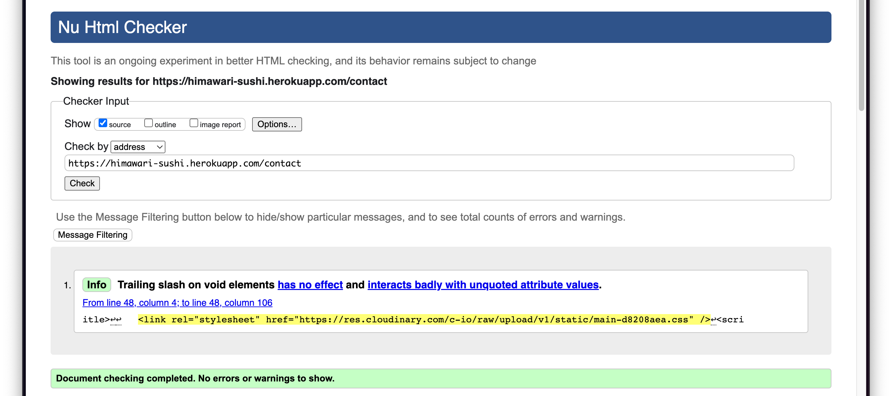
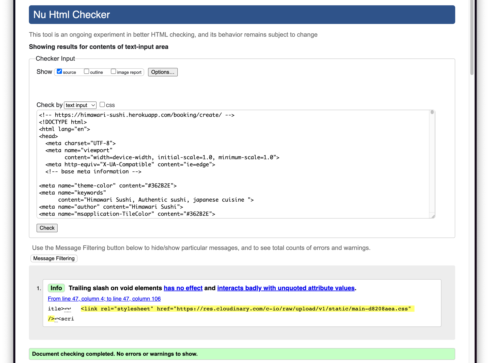
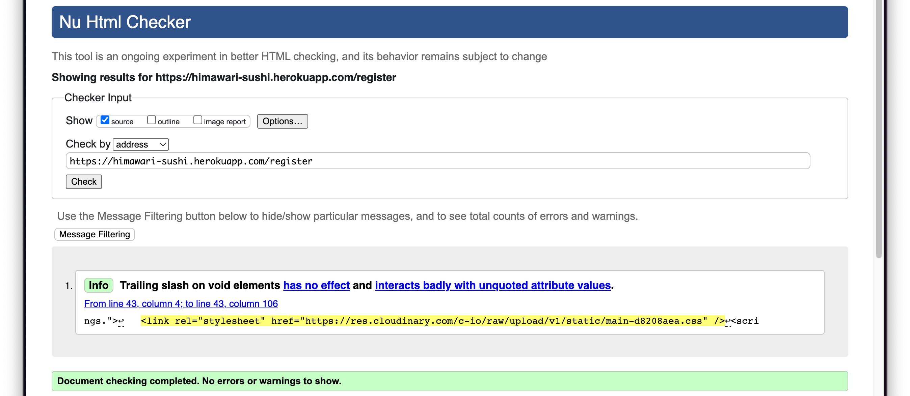
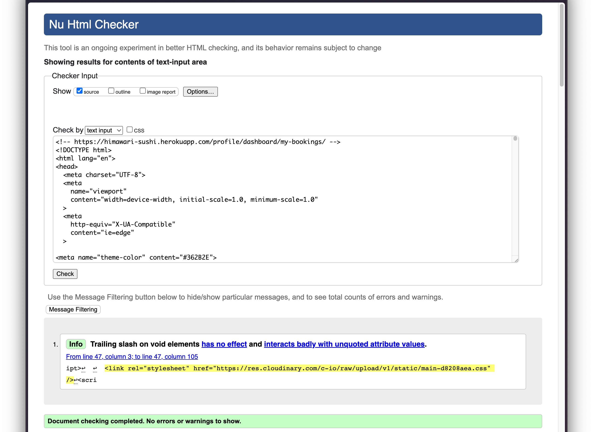
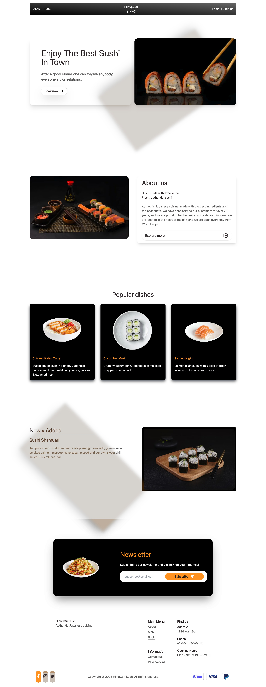
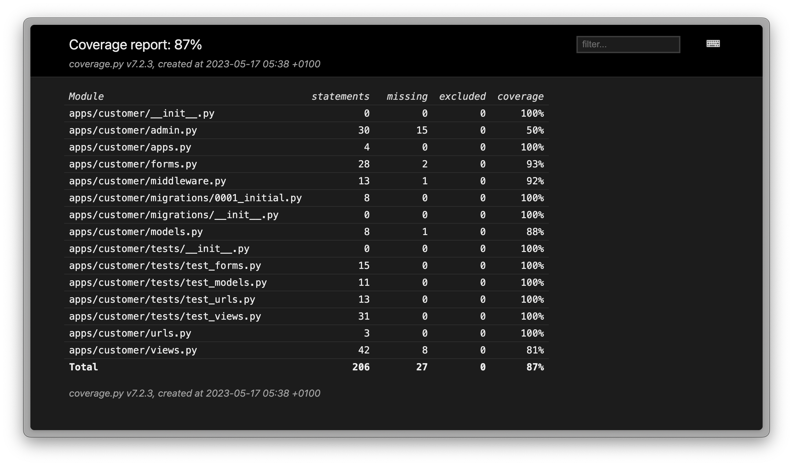

# Testing 🧪

Return back to the [README.md](README.md) file.

## Code Validation

### HTML

I have used the recommended [HTML W3C Validator](https://validator.w3.org) to validate all of my HTML files.
Some pages require a user to be logged-in and authenticated, in order to view the page. so I have used the
[validate by input](https://validator.w3.org/#validate_by_input) method, which requires you to copy/paste
the entire HTML code into the validator.

Pages that have (validate by input) next to them, require you to copy/paste the entire HTML code into the validator.

| Page                                    | W3C URL                                                                                     | Screenshot                                                                    | Notes     |
|-----------------------------------------|---------------------------------------------------------------------------------------------|-------------------------------------------------------------------------------|-----------|
| About                                   | [W3C](https://validator.w3.org/nu/?doc=https://himawari-sushi.herokuapp.com/about)          |                     | No errors |
| Contact                                 | [W3C](https://validator.w3.org/nu/?doc=https://himawari-sushi.herokuapp.com/contact)        |                   | No errors |
| Contact form success(validate by input) | [W3C](https://validator.w3.org/nu/?doc=https://himawari-sushi.herokuapp.com/contact)        |           | No errors |
| Create booking(validate by input)       | [W3C](https://himawari-sushi.herokuapp.com/nu/#textarea)                                    |  | No errors | 
| Create booking (logged out)             | [W3C](https://validator.w3.org/nu/?doc=https://himawari-sushi.herokuapp.com/booking/create) |            | No errors |
| Home                                    | [W3C](https://validator.w3.org/nu/?doc=https://himawari-sushi.herokuapp.com/)               |                      | No errors |
| Menu                                    | [W3C](https://validator.w3.org/nu/?doc=https://himawari-sushi.herokuapp.com/menu)           |                      | No errors |
| Register                                | [W3C](https://validator.w3.org/nu/?doc=https://himawari-sushi.herokuapp.com/register)       |                  | No errors |
| Login                                   | [W3C](https://validator.w3.org/nu/?doc=https://himawari-sushi.herokuapp.com/login)          |                     | No errors |
| Profile(validate by input)              | [W3C](https://validator.w3.org/nu/?doc=https://himawari-sushi.herokuapp.com/#textarea)      |         | No errors |
| Profile details(validate by input)      | [W3C](https://validator.w3.org/nu/?doc=https://himawari-sushi.herokuapp.com/#textarea)      |           | No errors |
| Profile bookings(validate by input)     | [W3C](https://validator.w3.org/nu/?doc=https://himawari-sushi.herokuapp.com/#textarea)      |          | No errors |
| Reservations                            | [W3C](https://validator.w3.org/nu/?doc=https://himawari-sushi.herokuapp.com/reservations)   |              | No errors |
| Subscribe success(validate by input)    | [W3C](https://validator.w3.org/nu/?doc=https://himawari-sushi.herokuapp.com/#textarea)      |         | No errors |
| Subscribe success (validate by input)   | [W3C](https://validator.w3.org/nu/?doc=https://himawari-sushi.herokuapp.com/#textarea)      |         | No errors |
| Error 404 (validate by input)           | [W3C](https://validator.w3.org/nu/?doc=https://himawari-sushi.herokuapp.com/#textarea)      |                 | No errors |

[🔝 Back to Top](#testing-)

### CSS

I have used the recommended [CSS Jigsaw Validator](https://jigsaw.w3.org/css-validator) to validate all of my CSS files.

There is only one single css file compiled & minified from all the other css files.

> 🔥**Important**
>
> CSS validation has returned 56 CSS parsing errors. This issue is a result of the final ccs build
> using [Tailwindcss](https://tailwindcss.com/). The maintainer of TailwindCSS has discussed this issue and provided a
> solution; however, the recommended fix cannot be used as it is causing issues with the styles used within the
>
application. [Remove --tw- variables from universal selector #7317](https://github.com/tailwindlabs/tailwindcss/discussions/7317)
> 🔗

| File     | W3C URL                                                                                                                                                                | Screenshot                                                     | Notes           |
|----------|------------------------------------------------------------------------------------------------------------------------------------------------------------------------|----------------------------------------------------------------|-----------------|
| main.css | [w3c validator](https://jigsaw.w3.org/css-validator/validator?uri=https://himawari-sushi.herokuapp.com/&profile=css3svg&usermedium=all&warning=1&vextwarning=&lang=en) |  | Fail: 56 errors |

### TypeScript

I have used [Eslint](https://eslint.org/) to validate all of my TypeScript files. I have used the recommended
Eslint & [typescript-eslint](https://typescript-eslint.io/) plugins to validate all of my TS files with a custom
configuration located in `.tsconif.json` at the root directory.

This evolved using pnpm to install the Eslint with TypeScript plugins located in `package.json` located at the root
directory. I can run the following command to validate all of my TS files:

> **Note**
>
> You will need to have [pnpm](https://pnpm.io/) installed to run the following command, or you can use npm or yarn.

```bash
pnpm  eslint --fix-dry-run static/src/js/main.ts
```

The ide im using [PyCharm](https://www.jetbrains.com/pycharm/download/#section=mac) is also highlighting any
TypeScript / Eslint errors in the code. This is based on the configuration in
the `.eslintrc.yml` & `tsconfig.json` file.

Pycharm generated report:

| File                      | Screenshot                                                             | Notes                                                    |                                                    
|---------------------------|------------------------------------------------------------------------|----------------------------------------------------------|
| Pycharm inspection report |  | Eslint redundant double negation (no-extra-boolean-cast) |

### Python

I have used the
recommended [PyCharm quality Assistance](https://www.jetbrains.com/help/pycharm/tutorial-code-quality-assistance-tips-and-tricks.html)
with built-in pep8 support to validate all of my Python files. This provides both instant analyses of the code along
with ability to generate a report. All python files were validated using pycharm inspection tools with the exceptions of
the following files:

- `All files located in migrations directories`
- `__init__.py`

| File                      | Screenshot                                                      | Notes     |
|---------------------------|-----------------------------------------------------------------|-----------|
| pycharm inspection report |  | No errors |

> **IMPORTANT**: Django settings.py
>
> The Django settings.py has been configured to ignore the following errors:
> - `E501 line too long (82 > 79 characters)`

`noqa` = **NO Quality Assurance**

Example:

```python
AUTH_PASSWORD_VALIDATORS = [
    {
        "NAME": "django.contrib.auth.password_validation.UserAttributeSimilarityValidator",  # noqa
    },
    {
        "NAME": "django.contrib.auth.password_validation.MinimumLengthValidator",  # noqa
    },
    {
        "NAME": "django.contrib.auth.password_validation.CommonPasswordValidator",  # noqa
    },
    {
        "NAME": "django.contrib.auth.password_validation.NumericPasswordValidator",  # noqa
    },
]
```

[🔝 Back to Top](#testing-)
## Browser testing

I utilised both manual and automated testing to test the application on various browsers and devices.
I used the following browsers to test the application:

- [Chrome](https://www.google.com/chrome)
- [Firefox (Developer Edition)](https://www.mozilla.org/firefox/developer)
- [Safari](https://support.apple.com/downloads/safari)

### Manual testing

Pages tested:

| Page                        | Sizes                     | Notes             |
|-----------------------------|---------------------------|-------------------|
| About page                  | Mobile - Tablet - Desktop | Works as expected |
| Booking page                | Mobile - Tablet - Desktop | Works as expected |
| Contact page                | Mobile - Tablet - Desktop | Works as expected |
| Login Page                  | Mobile - Tablet - Desktop | Works as expected |
| Menu page                   | Mobile - Tablet - Desktop | Works as expected |
| Profile page                | Mobile - Tablet - Desktop | Works as expected |
| Profile page - bookings     | Mobile - Tablet - Desktop | Works as expected |
| Profile page - user details | Mobile - Tablet - Desktop | Works as expected |
| Register Page               | Mobile - Tablet - Desktop | Works as expected |
| Reservations Page           | Mobile - Tablet - Desktop | Works as expected |

> **Note**
>
> I used [Polypane](https://polypane.app/) to test the application on multiple devices at the same time
> with the following configurations to ensure the application is responsive on all devices:
>
> - Mobile: 375px x 812px
> - Tablet: 744px x 1024px
> - Desktop: 1440px x 1080px

After inspection of all pages, I took screenshots of each page & on all device sizes noted above. They are available in
the [polypane folder](../docs/testing/polypane/) directory. Due
to the number of pages and screens tested, I have only included a few examples below.

| Page      | Mobile                                                              | Tablet                                                              | Desktop                                                               | Notes             |
|-----------|---------------------------------------------------------------------|---------------------------------------------------------------------|-----------------------------------------------------------------------|-------------------|
| Home Page |  |  |  | Works as expected |

### Automated testing

I used [Playwright](https://playwright.dev/) to test the application on multiple browsers and devices. The following
browsers & user actions were tested:

> **Note**
>
> All tests where recorded and are available in the [playwright folder](../docs/testing/e2e/playwright/videos)
> directory. Below are a few examples of the tests, you can find the playwright test files in the
> [test/playwright](../tests/playwright) directory.

Authentication testing:

| Browser                 | Device  | Page | Action            | Expected Result           | Actual Result       | Notes |
|-------------------------|---------|------|-------------------|---------------------------|---------------------|-------|
| Chrome, Safari, Firefox | Desktop | Home | test registration | user can register account | successful register | pass  |
| Chrome, Safari, Firefox | Mobile  | Home | test registration | user can register account | successful register | pass  |
| Chrome, Safari, Firefox | Mobile  | Home | test login        | user can login to account | successful login    | pass  |
| Chrome, Safari, Firefox | Desktop | Home | test login        | user can login to account | successful login    | pass  |
| Chrome, Safari, Firefox | Desktop | Home | test login fail   | display error message     | fail login          | pass  |
| Chrome, Safari, Firefox | Desktop | Home | test logout       | user logout               | successfully logout | pass  |

Booking testing:

| Browser                 | Device  | Page                        | Action              | Expected Result           | Actual Result             | Notes |
|-------------------------|---------|-----------------------------|---------------------|---------------------------|---------------------------|-------|
| Chrome, Safari, Firefox | Desktop | Booking create page         | test create booking | user can create a booking | successful booking        | pass  |
| Chrome, Safari, Firefox | Desktop | Profile booking delete page | test delete booking | user can delete a booking | successful booking delete | pass  |
| Chrome, Safari, Firefox | Desktop | Profile booking edit page   | test edit booking   | user can edit a booking   | successful booking edit   | pass  |

Contact form testing:

| Browser                 | Device  | Page         | Action            | Expected Result                           | Actual Result           | Notes |
|-------------------------|---------|--------------|-------------------|-------------------------------------------|-------------------------|-------|
| Chrome, Safari, Firefox | Desktop | Contact page | test contact form | user can send a message with contact form | successful message sent | pass  |

User profile form testing:

| Browser                 | Device  | Page         | Action            | Expected Result                               | Actual Result             | Notes |
|-------------------------|---------|--------------|-------------------|-----------------------------------------------|---------------------------|-------|
| Chrome, Safari, Firefox | Desktop | Profile page | test user profile | user can update profile & details are correct | successful profile update | pass  |

[🔝 Back to Top](#testing-)

## Lighthouse Audit

I used [Lighthouse cli](https://github.com/GoogleChrome/lighthouse) to audit the application. I tested the application
for each page on both mobile and desktop devices.

> **Note**
>
> I Added the results to the [lighthouse folder](../docs/testing/lighthouse) directory. It contains an HTML report for
> each page and device size. Please note I originally named the heroku url **django-suhshi.herokuapp.com**, but I
> changed
> it to **himawari-sushi.herokuapp.com**. The lighthouse reports are named using the original url; however, the results
> are correct. This change was for consistency with the project name.

| Page                    | Device  | Performance | Best Practices | Accessibility | SEO |
|-------------------------|---------|-------------|----------------|---------------|-----|
| Home page               | Mobile  | 87          | 100            | 100           | 100 |
| About page              | Mobile  | 94          | 100            | 100           | 100 |
| Booking Create page     | Mobile  | 98          | 100            | 100           | 100 |
| Menu page               | Mobile  | 98          | 100            | 100           | 100 |
| Contact page            | Mobile  | 98          | 100            | 100           | 100 |
| Reservations page       | Mobile  | 95          | 100            | 100           | 100 |
| Login page              | Mobile  | 98          | 100            | 100           | 100 |
| Register page           | Mobile  | 99          | 100            | 100           | 100 |
| Profile page            | Mobile  | 98          | 100            | 100           | 92  |
| Profile page - bookings | Mobile  | 98          | 100            | 100           | 92  |
| Profile page - details  | Mobile  | 98          | 100            | 100           | 92  |
| Home page               | Desktop | 97          | 100            | 100           | 97  |
| About page              | Desktop | 97          | 100            | 100           | 96  |
| Booking create page     | Desktop | 97          | 100            | 100           | 96  |
| Menu page               | Desktop | 98          | 100            | 100           | 96  |
| Contact page            | Desktop | 97          | 100            | 100           | 97  |
| Reservations page       | Desktop | 98          | 100            | 100           | 96  |
| Login page              | Desktop | 98          | 100            | 100           | 100 |
| Register page           | Desktop | 98          | 100            | 100           | 100 |
| Profile page            | Desktop | 100         | 100            | 92            | 90  |
| Profile page - bookings | Desktop | 100         | 100            | 92            | 90  |
| Profile page - details  | Desktop | 100         | 100            | 92            | 90  |

[🔝 Back to Top](#testing-)
## Python coverage

I used [coverage.py](https://coverage.readthedocs.io/en/coverage-5.5/) package to test the python code coverage. I used the CLI to run the tests and generate the report. All results are in the [coverage folder](../tests/htmlcov)

The following table shows the coverage for each app.

| App      | Screen Shot                                                     | Coverage |
|----------|-----------------------------------------------------------------|----------|
| Accounts |      | 93%      |
| Booking  |  | 86%      |
| Customer |  | 87%      |
| Home     |      | 93%      |
